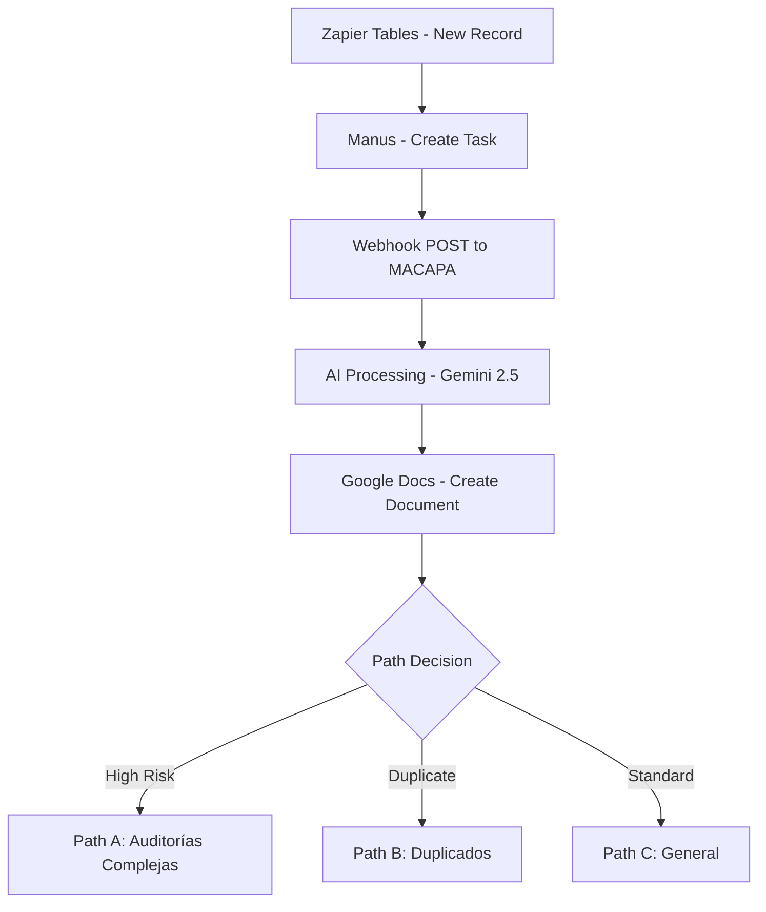

# Guía de Integración con Zapier - MACAPA

## 📋 Resumen de la Integración

Esta guía detalla cómo configurar el Zap **"Resultados Auditorias Forenses-Zap 8"** (ID: 339995837) para automatizar la generación de auditorías forenses utilizando MACAPA.

## 🔄 Flujo del Zap



## 🛠️ Configuración Paso a Paso

### Paso 1: Zapier Tables (Trigger)

**Configuración del Trigger:**
- **App**: Zapier Tables
- **Event**: New or Updated Record
- **Table**: Tabla de auditorías forenses

**Campos requeridos en la tabla:**
```json
{
  "recordId": "Identificador único del registro",
  "clientName": "Nombre del cliente",
  "projectName": "Nombre del proyecto",
  "description": "Descripción detallada",
  "type": "audit|consultancy|report",
  "priority": "high|medium|low",
  "auditType": "financial|digital|compliance|security",
  "riskLevel": "critical|high|medium|low",
  "complianceFramework": "ISO 27001|SOX|GDPR|etc",
  "evidenceFiles": "Lista de archivos de evidencia"
}
```

### Paso 2: Manus - Create Task

**Configuración:**
- **App**: Manus
- **Action**: Create Task
- **Task Name**: `Auditoría {{clientName}} - {{projectName}}`
- **Description**: `{{description}}`
- **Priority**: `{{priority}}`

### Paso 3: Webhook POST a MACAPA

**Configuración del Webhook:**
- **App**: Webhooks by Zapier
- **Action**: POST
- **URL**: `https://tu-dominio.com/api/webhooks/zapier/agent-activity`
- **Payload Type**: JSON
- **Method**: POST

**Headers requeridos:**
```json
{
  "Content-Type": "application/json",
  "X-Zapier-Signature": "{{webhook_signature}}"
}
```

**Payload JSON:**
```json
{
  "recordId": "{{recordId}}",
  "type": "{{type}}",
  "clientName": "{{clientName}}",
  "projectName": "{{projectName}}",
  "description": "{{description}}",
  "priority": "{{priority}}",
  "analysisData": {
    "sourceTable": "zapier_tables",
    "triggerTime": "{{trigger_timestamp}}",
    "manusTaskId": "{{manus_task_id}}"
  },
  "timestamp": "{{timestamp}}",
  "auditType": "{{auditType}}",
  "evidenceFiles": "{{evidenceFiles}}",
  "complianceFramework": "{{complianceFramework}}",
  "riskLevel": "{{riskLevel}}"
}
```

### Paso 4: Google Docs - Create Document

**Configuración:**
- **App**: Google Docs
- **Action**: Create Document From Text
- **Document Name**: `{{ai_generated_title}} - {{clientName}}`
- **Document Content**: `{{ai_generated_content}}`

**Mapeo de campos desde MACAPA:**
```json
{
  "title": "{{webhook_response.data.aiGenerated.title}}",
  "content": "{{webhook_response.data.aiGenerated.content}}",
  "metadata": "{{webhook_response.data.metadata}}"
}
```

### Paso 5: Paths - Configuración de Rutas

#### Path A: Auditorías Complejas
**Condición**: `{{riskLevel}} = "critical" OR {{riskLevel}} = "high"`

**Acciones adicionales:**
- Enviar notificación a supervisor
- Crear tarea de revisión en Manus
- Programar seguimiento automático

#### Path B: Duplicados
**Condición**: `{{webhook_response.data.zapPath.path}} = "B"`

**Acciones adicionales:**
- Buscar documentos similares
- Enviar alerta de duplicado
- Solicitar confirmación para proceder

#### Path C: General
**Condición**: Todos los demás casos

**Acciones adicionales:**
- Enviar documento por email
- Actualizar estado en tabla
- Archivar en Google Drive

## 🔧 Configuración Avanzada

### Autenticación de Webhooks

Para mayor seguridad, configura la verificación de firma:

```javascript
// En MACAPA backend
const crypto = require('crypto');

function verifyZapierSignature(payload, signature) {
  const expectedSignature = crypto
    .createHmac('sha256', process.env.ZAPIER_WEBHOOK_SECRET)
    .update(JSON.stringify(payload))
    .digest('hex');
    
  return crypto.timingSafeEqual(
    Buffer.from(signature, 'hex'),
    Buffer.from(expectedSignature, 'hex')
  );
}
```

### Manejo de Errores

**Configuración en Zapier:**
- **Error Handling**: Continue on Error
- **Retry Logic**: 3 intentos con backoff exponencial
- **Timeout**: 30 segundos

**Respuestas de error de MACAPA:**
```json
{
  "success": false,
  "error": "Processing failed",
  "message": "Descripción del error",
  "requestId": "uuid-request-id",
  "retryable": true
}
```

## 📊 Monitoreo y Debugging

### Logs en MACAPA

```javascript
// Ejemplo de log de webhook
logger.info(`[${requestId}] Webhook received from Zapier`, {
  zapId: '339995837',
  recordId: validatedData.recordId,
  type: validatedData.type,
  client: validatedData.clientName,
  processingTime: Date.now() - startTime
});
```

### Dashboard de Zapier

Monitorea el rendimiento del Zap:
- **Success Rate**: >95%
- **Average Processing Time**: <30 segundos
- **Error Rate**: <5%

### Métricas en MACAPA

```bash
# Endpoint de métricas
GET /api/webhooks/stats

# Respuesta
{
  "totalWebhooks": 1250,
  "successRate": 98.4,
  "averageProcessingTime": "12.5s",
  "byType": {
    "audit": 800,
    "consultancy": 300,
    "report": 150
  }
}
```

## 🧪 Testing

### Test del Webhook

```bash
# Prueba manual del endpoint
curl -X POST https://tu-dominio.com/api/webhooks/zapier/agent-activity \
  -H "Content-Type: application/json" \
  -H "X-Zapier-Signature: test-signature" \
  -d '{
    "recordId": "test-123",
    "type": "audit",
    "clientName": "Cliente Test",
    "projectName": "Proyecto Test",
    "description": "Prueba de integración",
    "priority": "medium",
    "auditType": "digital",
    "riskLevel": "medium"
  }'
```

### Test del Zap Completo

1. **Crear registro de prueba** en Zapier Tables
2. **Verificar trigger** en Zapier Dashboard
3. **Revisar logs** en MACAPA
4. **Validar documento** generado en Google Docs

## 🚨 Troubleshooting

### Problemas Comunes

#### 1. Webhook no se ejecuta
```bash
# Verificar conectividad
curl -I https://tu-dominio.com/api/webhooks/zapier/test

# Verificar logs
tail -f backend/logs/combined.log | grep webhook
```

#### 2. Error de autenticación
```bash
# Verificar secret de Zapier
echo $ZAPIER_WEBHOOK_SECRET

# Regenerar signature
node -e "
const crypto = require('crypto');
const payload = {...};
const signature = crypto.createHmac('sha256', 'tu-secret').update(JSON.stringify(payload)).digest('hex');
console.log(signature);
"
```

#### 3. Timeout en procesamiento IA
```javascript
// Aumentar timeout en Zapier
// Configurar retry logic en MACAPA
const retryConfig = {
  retries: 3,
  retryDelay: 2000,
  retryCondition: (error) => error.code === 'TIMEOUT'
};
```

### Códigos de Error

| Código | Descripción | Acción |
|--------|-------------|---------|
| 400 | Payload inválido | Verificar estructura JSON |
| 401 | Autenticación fallida | Verificar signature |
| 429 | Rate limit excedido | Reducir frecuencia |
| 500 | Error interno | Revisar logs del servidor |
| 503 | Servicio no disponible | Verificar estado del servicio |

## 📈 Optimización

### Performance

1. **Batch Processing**: Procesar múltiples registros en una sola llamada
2. **Caching**: Cache de respuestas de IA para contenido similar
3. **Async Processing**: Procesamiento asíncrono para requests largos

### Escalabilidad

```javascript
// Queue system para procesamiento asíncrono
const Queue = require('bull');
const webhookQueue = new Queue('webhook processing');

webhookQueue.process(async (job) => {
  const { payload } = job.data;
  return await aiService.generateContent(payload);
});
```

## 📞 Soporte

### Contactos
- **Zapier Support**: support@zapier.com
- **MACAPA Support**: support@macapa.com
- **Documentación**: https://docs.macapa.com/zapier

### Recursos Adicionales
- [Zapier Webhooks Documentation](https://zapier.com/help/webhooks)
- [MACAPA API Reference](./API.md)
- [Gemini AI Documentation](https://ai.google.dev/docs)

---

**¿Necesitas ayuda?** Contacta al equipo de integración en integration@macapa.com